# Proyecto 2 - Introducción a la Inteligencia Artificial

>### 1. Crear el environment de Conda
 >env create -f environment.yml
 >### 2. Activar el Environment
>conda activate birds
- Fabián Ayala Castillo
- Carla Herrera Vidal

## Clasificación de especies de aves mediante Deep Learning

## Definición del problema

### Claridad y Relevancia

El proyecto aborda un problema de clasificación de imágenes en el ámbito de la biodiversidad, específicamente la identificación automática de especies de aves a partir de fotografías. El reconocimiento manual de especies requiere conocimiento experto en ornitología y puede resultar lento y propenso a errores, especialmente cuando existen especies con plumas similares o variaciones no tan notables entre machos y hembras de una misma especie. Automatizar esta tarea mediante un momdelo de deep learning podría aumentar la eficiencia y precisión, donde se requiere procesar grandes volúmenes de imágenes de manera rápida y consistente.

El problema consiste en que dada una imagen de un ave se pueda predecir a cual de esas 20 especies distintas pertenece. Esto es un problema de clasificación multiclase, donde el modelo aprenderá a distinguir patrones visuales que diferencian a cada especie.

## Plan de acción

### Descripción del dataset y fuente

Se utilizará el dataset *"Birds 20 Species - Image Classification"* descargado de Kaggle: [https://www.kaggle.com/datasets/umairshahpirzada/birds-20-species-image-classification/data](https://www.kaggle.com/datasets/umairshahpirzada/birds-20-species-image-classification/data) (Se prefirió no subirlo al github por el peso de las imagenes de 72.67MB)

El dataset contiene imágenes a color en formato jpg, organizadas en tres subconjuntos ya definidos:

- **Entrenamiento:** 3208 imágenes, distribuidas en subcarpetas por especie (130 imágenes por especie, es decir, dataset no balanceado).
- **Validación:** 100 imágenes (5 por especie).
- **Test:** 100 imágenes (5 por especie).

Cada imagen del dataset contiene un solo ejemplar, el cual ocupa al menos el 50% de la imagen. Esto ayuda a que el modelo se enfoque en el ave y disminuye el ruido del fondo durante el entrenamiento.

Como limitación, se indica que cerca del 80% de las imágenes corresponden a aves macho y solo el 20% a hembras. Debido a este desbalance, es posible que el modelo tenga un menor rendimiento al clasificar hembras, ya que los conjuntos de validación y prueba están formados principalmente por imágenes de machos. Además,se señala que todas las imágenes duplicadas detectadas fueron eliminadas para evitar que existieran imágenes repetidas entre los conjuntos de entrenamiento, validación y prueba, lo que ayuda a realizar una evaluación más confiable del modelo.

### Modelo seleccionado y estrategia de evaluación

Se utilizará un modelo de Deep Learning pre-entrenado sobre PyTorch, aplicando la técnica ResNet.  Esta red neuronal ya fue entrenada previamente con millones de imágenes de la base de datos ImageNet usando la técnica transfer learning. El modelo se cargará con sus pesos ya entrenados.

Para el desarrollo del proyecto, se congelarán todas las capas de la red original. Con esto se le indicará al modelo que no modifique las características que ya aprendió en su entrenamiento inicial. Posteriormente, se reemplazará únicamente la última capa encargada de clasficar por una nueva ajustada para reconocer las 20 especies de aves, procediendo a entrenar únicamente esta sección. Por otro lado, el rendmiento del modelo se evaluará combinando diferentes métricas para obtener un análisis detallado y completo del sistema. Por una parte, se graficarán las curvas de aprendizaje para comparar la pérdida en los datos de entrenamiento y de validación en cada época, lo que ayudará a detectar si el modelo evoluciona correctamente o si sufre de overfitting. También se medirá el porcentaje de aciertos con un conjunto de datos de prueba totalmente nuevo para comprobar su capacidad de generalización. Además, se generará un reporte con la accuracy y f1 para cada especie, lo cual es muy importante ya que el conjunto de datos no está balanceado. Para resolver esta diferencia en la cantidad de fotos por ave, se aplicarán pesos de clase en la función de pérdida para que todas las categorías tengan la misma importancia durante el entrenamiento. Por último, se realizarán pruebas manuales con imágenes externas para revisar los porcentajes de probabilidad que el modelo asigna a cada predicción, lo que permitirá observar cómo reacciona ante errores o al recibir fotos de aves que no pertenecen al proyecto.

## Justificación del modelo: ventajas, limitaciones y pertinencia

Para clasificar las 20 especies de aves se utilizará la arquitectura ResNet50 mediante transfer learning, cargando el modelo con sus pesos preentrenados en ImageNet. El proceso consiste en congelar todas las capas originales para conservar el conocimiento previo de carcterísticas, reemplazando la última capa de la red por una nueva diseñada específicamente para las categorías del proyecto, de modo que solo esta sección final sea la que se entrene.

* **Ventajas**: el uso de este modelo permite aprovechar un conocimiento previo, ya que el sistema viene entrenado para reconocer formas, colores y texturas de millones de imágenes, incluyendo animales. Esto genera un gran ahorro de tiempo y recursos, debido a que solo se debe entrenar la parte final de la red. 

* **Limitaciones**: por otro lado, mantener "bloqueada" la mayor parte de la red impide que el sistema capte rasgos muy específicos de las aves, como detalles únicos en el plumaje. Esto puede provocar una confusión visual entre especies que se parezcan demasiado físicamente. Además, el sistema es incapaz de reconocer algo desconocido para el; por lo que si se le muestra un ave extraña que no pertenece al proyecto, se verá forzado a elegir una de las 20 opciones de forma obligatoria.

* **Pertinencia**: esta estrategia es indicada para resolver el problema de clasificar 20 especies de aves con un conjunto limitado de imágenes. Puesto que es más eficiente aprovechar la inteligencia visual que el modelo ya construyó previamente, en lugar de gastar tiempo buscando miles de fotos nuevas para entrenar una red neuronal completamente desde cero.

## Implementación y Resultados

### EDA 

Primeramente, se definen las rutas de las carpetas principales del proyecto, identificando la ubicación de las imágenes para el entrenamiento, la validación y las pruebas finales del modelo. A continuación, el sistema obtiene la lista de las especies disponibles en la carpeta de entrenamiento para seleccionar las primeras diez incluyendo el nombre de cada ave como título. 

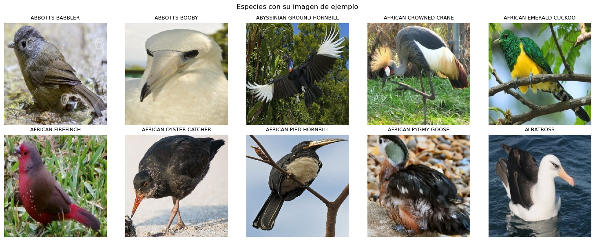

Luego, se define una funcion para contar el número de imágenes que existen por especie en cada conjunto de datos: 

| Conjunto de Datos | Cantidad |
| :--- | :--- |
| Total imágenes train (Entrenamiento) | 3208 |
| Total imágenes valid (Validación) | 100 |
| Total imágenes test (Prueba) | 100 |
| **Número total de especies** | **20** |

Una vez obtenido el conteo de imágenes por subconjunto, se filtra el set de train para extraer el ave con la mayor cantidad de imagenes:

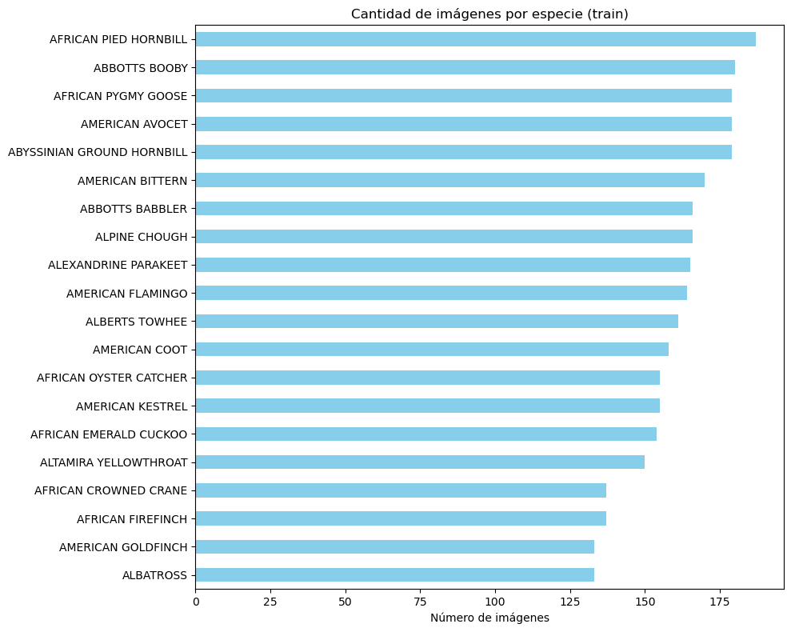

El gráfico muestra un desequilibrio leve en el conjunto train, donde la cantidad de fotos por especie varía en un rango de entre aproximadamente 130 y 190 imágenes. La clase con mayor representación en el catálogo es *AFRICAN PIED HORNBILL*, superando las 175 fotografías, mientras que la especie *ALBATROSS* es la que cuenta con el menor volumen de datos, ubicándose cerca de las 130 muestras aprox. Aunque la diferencia en cantidad no es mucha, se confirma que los datos no están balanceados, lo que justifica la aplicación de pesos de clase durante el entrenamiento para asegurar que el modelo no se sesgue hacia las aves más frecuentes y evalúe a todas las categorías con la misma importancia.

Posterior a eso, se usó la función *describe()* para revisar de forma rápida el tamaño de una muestra de imágenes del dataset y así saber si era necesario cambiarles el tamaño antes de entrenar el modelo. 

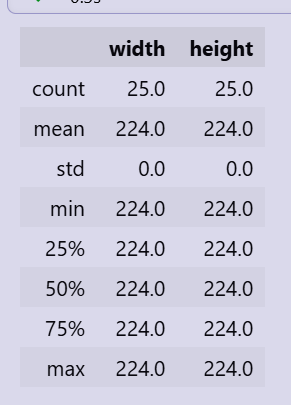

Al revisar los resultados, se observa que todas las imágenes de la muestra miden exactamente 224 de ancho por 224 de alto, sin ninguna variación entre ellas hciendo que la desviación estándar sea 0. Esto significa que las imágenes ya vienen con un tamaño uniforme, por lo que no fue necesario aplicar un redimensionamiento adicional antes de usarlas en el entrenamiento. 

Sin embargo, el análisis previo mostró que algunas especies de aves tienen bastantes más imágenes que otras. Esto es un problema, porque si el modelo ve muchas más fotos de una especie que de otra, puede terminar aprendiendo a acertar solo en las especies con más ejemplos, y fallar en las que tienen pocas. Para evitar eso, se calculó un peso distinto para cada especie: a las especies con pocas imágenes se les da un peso más alto, y a las que tienen muchas imágenes se les da un peso más bajo. De esta forma, cuando el modelo se equivoca en una especie con pocas fotos.

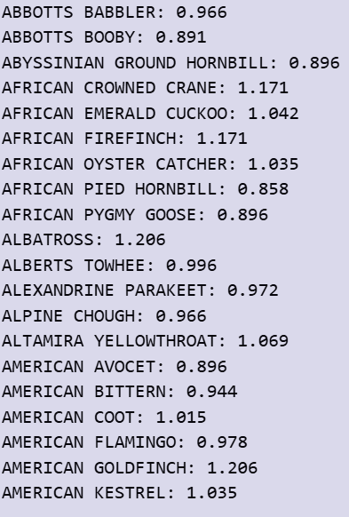

### Feature Engineering 

Para el comienzo de la transformación de la data, se importó la arquitectura ResNet50 y se establece una secuencia de preprocesamiento; primero se cambia el tamaño de la imagen a 256 pixeles y luego se recorta para dejarla en 224x224 que es el tamaño que el modelo espera. Los datos se convierten en un tensor para que esté en el formato numérico correcto y se normalizan con la media y desviación estándar de ImageNet, asegurando que las imagenes lleguen al modelo en las mismas condiciones que este aprendió.

### Entrenamiento (Optimización). 

En esta etapa se cargan automáticamente los conjuntos de entrenamiento, validación y prueba, identificando cada subcarpeta como una especie distinta de ave. Las imágenes se organizan en grupos de 32 y, en el conjunto de entrenamiento, se mezclan aleatoriamente para mejorar la capacidad de generalización del modelo.

Posteriormente, se carga la red neuronal preentrenada ResNet50 y se adapta al problema de clasificación de las 20 especies de aves, reemplazando su última capa para ajustarla a las categorías del proyecto.Luego se congelan los pesos de las capas de ResNet50 para mantener el conocimiento aprendido durante su entrenamiento previo. Después, se reemplaza la última capa por una nueva con 20 salidas, una para cada especie de ave. Para el entrenamiento se utiliza la loss function CrossEntropyLoss, incorporando pesos para compensar el desbalance entre las clases.

El entrenamiento se realiza durante 10 epochs. En cada una de ellas, el modelo procesa las imágenes del conjunto de entrenamiento, calcula el error, ajusta los pesos de la última capa y registra la pérdida obtenida. Posteriormente, se evalúa con el conjunto de validación, donde se calculan la pérdida y la precisión sin modificar los parámetros del modelo. 

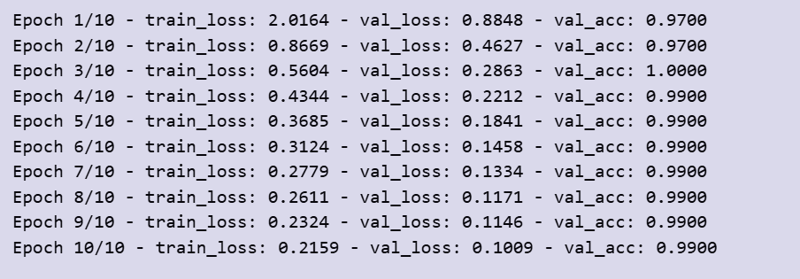

La imagen muestra que tanto la loss function del entrenamiento *train_loss* como la función de pérdida de validación *val_loss* disminuyen de forma progresiva a medida que aumentan las épocas. En particular, la pérdida de entrenamiento baja desde 2,0164 hasta 0,2159, mientras que la pérdida de validación disminuye desde 0,8848 hasta 0,1009, lo que indica que el modelo aprende a realizar mejores predicciones con el paso del entrenamiento. En cambio, la precisión sobre el conjunto de validación *val_acc* se mantiene prácticamente constante durante todo el proceso. Después de iniciar con un 97%, alcanza un 100% en la tercera epoch y luego se estabiliza alrededor del 99% en las épocas restantes. Esto sugiere que el modelo logra una alta capacidad de clasificación desde las primeras épocas.

El gráfico de abajo muestra la evolución de la función de pérdida durante el entrenamiento y la validación. 

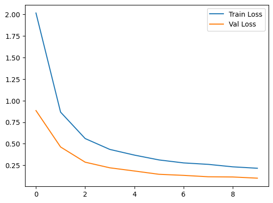

Y se observa que la curva de validación se mantiene por debajo de la curva de entrenamiento durante todo el proceso, lo que sugiere que el modelo generaliza adecuadamente sobre datos no utilizados para el ajuste de los parámetros por tanto no hay overfitting.

Una vez finalizado el entrenamiento, el modelo se evaluó utilizando el conjunto de prueba, el cual no fue empleado durante el entrenamiento ni la validación. El modelo obtuvo una accuracy del 99% (accuracy = 0,99), lo que indica que clasificó correctamente todas las imágenes del conjunto de prueba y demuestra una buema capacidad de generalización para las 20 especies de aves consideradas en el proyecto.

### Control de overfitting (Regularización).  

Con el fin de evaluar el posible overfitting del modelo, se realizó un segundo entrenamiento incorporando la regularización L2 de weight decay en el optimizador SGD. Este entrenamiento se llevó a cabo utilizando la misma arquitectura, los mismos hiperparámetros y el mismo número de épocas que el modelo base, de manera que la única diferencia entre ambos correspondiera a la incorporación de la regularización. Posteriormente, se compararon las curvas de pérdida y las métricas obtenidas para analizar el efecto de esta técnica sobre la capacidad de generalización del modelo.

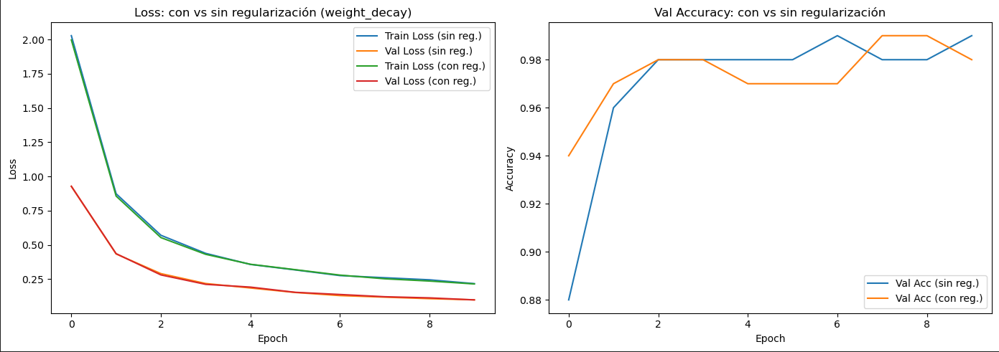

Las lineas de pérdidas de entrenamiento y validación con regularización y sin regularización se superponen casi de manera identica. Esto nos indica que la penalización de los pesos no está haciendo una alteración en la forma que el modelo aprende.

En ambos presenta ausencia de Overfitting, ambas curvas descienden de forma constante y se estabilizan, indicando que el modelo generaliza bien por sí solo.

Ambos modelos alcanzan una precisión de validación muy alta (Alrededor del 98% - 99%).

### Testeo

Dado que el modelo obtuvo una precisión muy alta sobre el conjunto de prueba, se realizó una evaluación adicional utilizando las imágenes de la carpeta *"images to predict"* incluida en el dataset, según se estudió en el código estas son seis. Esta carpeta contiene seis imágenes independientes que permiten comprobar el comportamiento del modelo sobre ejemplos individuales. Para ello, se cargaron las seis imágenes y se prepararon para ser ingresadas al modelo, con el objetivo de verificar si la especie predicha corresponde a la especie real. La imagende abajo muestra como ejemplo la segunda imagen de la carpeta, correspondiente a una grulla coronada.

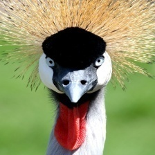

Posteriormente, las seis imágenes fueron preparadas para su clasificación aplicando el mismo preprocesamiento utilizado durante el entrenamiento del modelo, incluyendo el cambio de tamaño, el recorte y la normalización. Finalmente, las imágenes quedaron listas para ser ingresadas al modelo y obtener la especie predicha para cada una.

### Visualiazación de los resultados

Las imágenes a predecir incluidas en el dataset pero no consideradas para train:

<table>
<tr>
<td align="center">
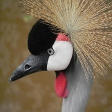 
<b>Imagen 1</b>
</td>

<td align="center">
 
<b>Imagen 2</b>
</td>

<td align="center">
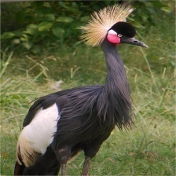 
<b>Imagen 3</b>
</td>

<td align="center">
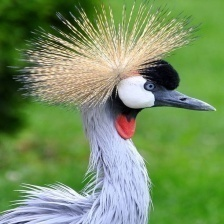 
<b>Imagen 4</b>
</td>

<td align="center">
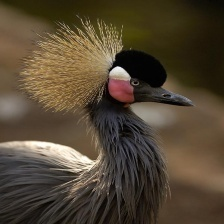 
<b>Imagen 5</b>
</td>

<td align="center">
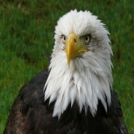 
<b>Imagen 6</b>
</td>
</tr>
</table>

Las imágenes de abajo presenta las cinco especies con mayor probabilidad predichas por el modelo para cada una de las seis imágenes evaluadas. En las primeras cinco imágenes, el modelo identificó correctamente la especie African Crowned Crane con un 99%, asignándole probabilidades superiores al 91% y alcanzando valores cercanos al 99% en cuatro de los casos. Estos resultados muestran que el modelo es capaz de reconocer la especie con un alto nivel de confianza, incluso cuando existen diferencias en el ángulo, la postura o el encuadre de la fotografía.

<table>
<tr>
<td align="center">
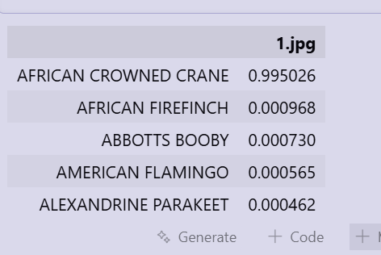 
<b>Imagen 1</b>
</td>

<td align="center">
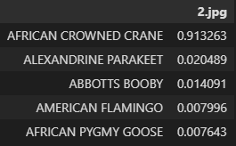 
<b>Imagen 2</b>
</td>

<td align="center">
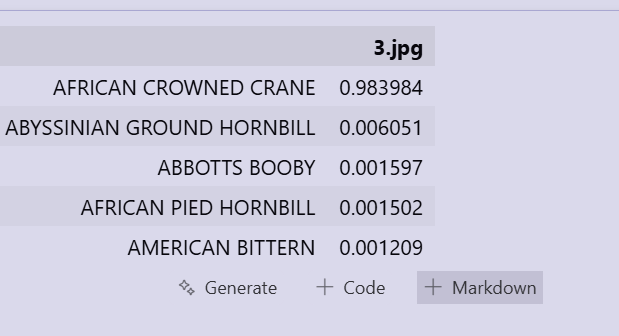 
<b>Imagen 3</b>
</td>
</tr>
</table>

<table>
<tr>
<td align="center">
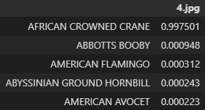 
<b>Imagen 4</b>
</td>

<td align="center">
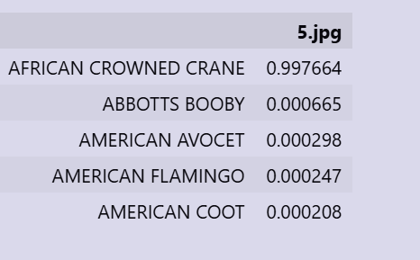 
<b>Imagen 5</b>
</td>

<td align="center">
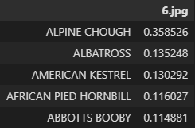 
<b>Imagen 6</b>
</td>
</tr>
</table>

En cambio, la sexta imagen corresponde a un Bald Eagle, una especie que no forma parte de las 20 categorías utilizadas durante el entrenamiento. 

Debido a ello, el modelo no pudo clasificarla correctamente y asignó una probabilidad de 35,85% a la especie más similar (ALPINE CHOUGH) dentro de las clases conocidas. Este comportamiento es esperable, ya que el modelo siempre debe elegir una de las especies con las que fue entrenado y no dispone de una categoría para indicar que la imagen pertenece a una especie desconocida.

Para analizar este resultado, se comparó la imagen del águila calva con una imagen representativa de la especie predicha por el modelo, la cual corresponde a *ALPHINE CHOUGH*. 

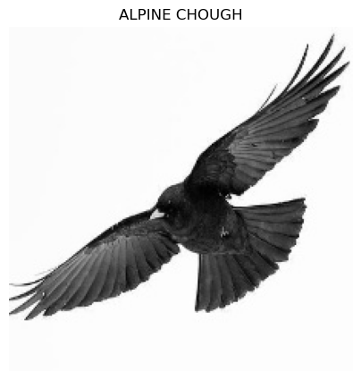

Ambas comparten características visuales, como una silueta oscura, el vuelo con las alas extendidas y una forma corporal similar, lo que probablemente influyó en la decisión del modelo. Este caso limita el modelo, no pudiendo identificar correctamente especies que no estuvieron presentes durante el entrenamiento.

### Métricas de desempeño

El reporte de clasificación presenta para cada una de las 20 especies, tres métricas principales: *precision*, que indica de todas las predicciones realizadas por el modelo para una especie determinada cuántas fueron correctas; *recall*, que mide cuántas de las imágenes que realmente pertenecían a esa especie fueron identificadas correctamente; y *f1-score*, que corresponde a una combinación entre precision y recall. Además, se incluye el valor de *support*, que representa la cantidad de imágenes disponibles en el conjunto de prueba para cada especie.

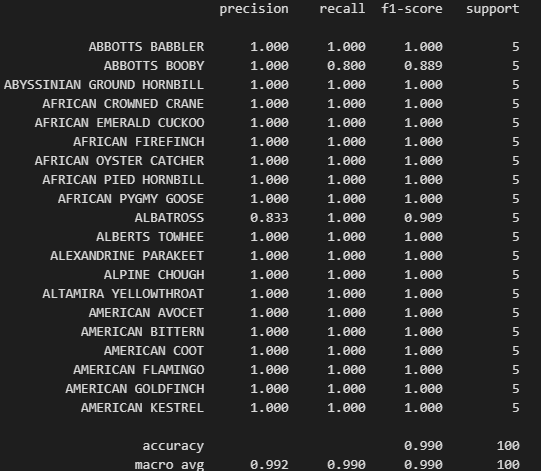

Los resultados obtenidos muestran un desempeño prácticamente perfecto del modelo, alcanzando valores de 1.000 en precision, recall y f1-score para 18 clases, además de un accuracy global del 99%. Este resultado es llamativo, ya que en problemas reales de clasificación de imágenes es poco frecuente que un modelo logre clasificar en un porcentaje tan alto todos los ejemplos sin cometer ningún error. Por esta razón, un resultado de este tipo debe analizarse pensando en overfitting o sea que el modelo haya aprendido patrones demasiado específicos de las imágenes de entrenamiento en lugar de generalizar correctamente a las aves.

Sin embargo, de acuerdo a la literatura en este caso existen varios factores que permiten explicar este comportamiento y sugieren que el resultado no necesariamente se debe a un problema de overfitting; primeramente el tamaño reducido del conjunto de test: Cada especie cuenta con solo 5 imágenes de evaluación (100 en total), por lo que obtener un 99% de accuracy es más probable que en un conjunto de datos más grande, donde podrían aparecer más errores. Además el modelo viene preentrenado; ResNet50 utiliza características aprendidas previamente a partir de millones de imágenes, lo que según Ultralytics. (s.f.). permite reconocer patrones visuales complejos y reduce el riesgo de que el modelo simplemente memorice las imágenes de entrenamiento. Por otro lado, hay diferencias claras entre especies ya que las clases presentan características visuales muy distintas, como colores, tamaños y formas, facilitando la separación entre categorías. Y finalmente es un dataset controlado: Las imágenes muestran principalmente un solo ejemplar con fondos poco complejos, lo que simplifica la clasificación en comparación con escenarios reales según Marcelino, P. (2018, 23 de octubre).

## Conclusiones
Haber utilizado el transfer learning fue una buena decisión, el uso de la arquitectura preentrenada ResNet50, combinado con la congelación de las capas iniciales, demostró ser una estrategia altamente eficiente.

El 99% de accuracy indica un excelente desempeño dentro del conjunto de prueba utilizado, pero no garantiza un funcionamiento perfecto en cualquier situación. La prueba con un águila pelada, especie no incluida en el entrenamiento, mostró que el modelo tiene limitaciones al enfrentarse a nuevas categorías, confirmando que su buen rendimiento está limitado al dominio específico del dataset.

Contar con un porcentaje balanceado de datos del género ayudaría a que el modelo no presente sesgos al identificar si el ave es macho o hembra, ya que actualmente el 80% de las imágenes de entrenamiento corresponden a machos. De esta manera, el modelo no solo podría identificar la especie del ave, sino también predecir su sexo.

## Referencias

* Ornithology | Zoology | Research Starters | EBSCO Research. (s. f.). EBSCO. https://www.ebsco.com/research-starters/zoology/ornithology 

* Innovatiana. (s. f.). Descubre ResNet-50: Una guía completa de la revolucionaria arquitectura de aprendizaje profundo. Innovatiana. https://www.innovatiana.com/es/post/discover-resnet-50

* Amazon Web Services. (s. f.). ¿Qué es el aprendizaje por transferencia? Amazon Web Services, Inc. https://aws.amazon.com/es/what-is/transfer-learning/

* Innovatiana. (s. f.). ImageNet: El conjunto de datos que revolucionó la visión por computadora. Innovatiana. https://www.innovatiana.com/es/datasets/imagenet

* Xu, W., Fu, Y.-L., y Zhu, D. (2023). ResNet and its application to medical image processing: Research progress and challenges. Computer Methods and Programs in Biomedicine, 240, 107660. https://doi.org/10.1016/j.cmpb.2023.107660 

* GeeksforGeeks. (2025, 23 de julio). How does L1 and L2 regularization prevent overfitting? https://www.geeksforgeeks.org/machine-learning/how-does-l1-and-l2-regularization-prevent-overfitting/ 

* Ultralytics. (s.f.). YOLOv5 transfer learning with frozen layers. https://docs.ultralytics.com/yolov5/tutorials/transfer-learning-with-frozen-layers#how-layer-freezing-works

* Marcelino, P. (2018, 23 de octubre). Transfer learning from pre-trained models. Medium. https://medium.com/data-science/transfer-learning-from-pre-trained-models-f2393f124751 
## Declaración de uso IA

Se declara que para el proyecto se utilizaron herramientas de inteligencia artificial para bugs y errores en códigos, y revisión de redacción y gramática del informe, mas las ideas y análisis son propios de Fabián y Carla.
